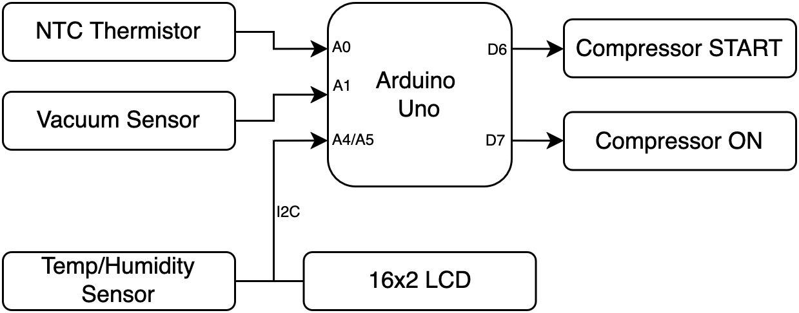

# Arduino Compressor Controller Skeleton

## Project Purpose

This repository contains the **bare‑bones firmware and wiring plan** for an Arduino Uno‑based controller that will ultimately monitor temperature, humidity and vacuum, and drive a two‑stage compressor.

*Current phase*: infrastructure and basic control logic implemented.

---

## Hardware Bill of Materials

| Qty  | Component                                        | Notes                                                       |
| ---- | ------------------------------------------------ | ----------------------------------------------------------- |
| 1    | **Arduino Uno R3** (ATmega328P)                  | Main MCU board                                              |
| 1    | **16×2 LCD with I²C backpack**                   | Typical address `0x27` or `0x3F`                            |
| 1    | **I²C Temp/Humidity sensor** (e.g. SHT30/SHT31)  | Shares I²C bus with LCD                                     |
| 1    | **NTC Thermistor**                               | Simulated with potentiometer on *A0* for now                |
| 1    | **Vacuum sensor** (analog)                       | Simulated with potentiometer on *A1*                        |
| 2    | **LEDs + 220 Ω resistors**                       | Visual placeholders for compressor *START* and *ON* outputs |
| Misc | Breadboard & jumpers                             | For rapid prototyping                                       |

---

## Detailed Pin Map

| **Component**               | **Arduino Pin(s)**  | **Type**           | **Direction** | **Notes** |
|----------------------------|---------------------|--------------------|---------------|-----------|
| **NTC Thermistor**         | A0                  | Analog             | Input         | Simulated with potentiometer |
| **Vacuum Sensor**          | A1                  | Analog             | Input         | Simulated with potentiometer |
| **SHT30/31 Temp/Humidity** | A4 (SDA), A5 (SCL)   | I²C (digital)      | Input         | Shares I²C bus with LCD |
| **16×2 LCD Display**       | A4 (SDA), A5 (SCL)   | I²C (digital)      | Output        | I²C backpack required |
| **Compressor START**       | D6                  | Digital            | Output        | Connected to LED + resistor or relay |
| **Compressor ON**          | D7                  | Digital            | Output        | Connected to LED + resistor or relay |

> ✅ **I²C is a shared bus** — A4 and A5 are used by both the LCD and SHT30/31. No conflict occurs as long as I²C addresses are different (`0x27` for LCD, `0x44` or `0x45` for SHT30/31).

---

## Free and Reserved Pins

| **Pin(s)**     | **Status**   | **Suggested Use**         |
|----------------|--------------|----------------------------|
| D0–D1          | Reserved      | UART (Serial comm)         |
| D2–D5, D8–D13  | Free          | Available for expansion    |
| A2–A3          | Free          | Extra analog sensors       |
| A6–A7          | Not present   | Not on DIP Uno, SMD only   |

---

## Block Diagram



---

## Repository Layout

```
.
├── src/
│   └── compressor_controller.ino   ← main firmware file
├── wokwi/
│   └── simulation files
├── demo.mp4                        ← optional local video demo
└── README.md                       ← this file
```

---

## Required Arduino Libraries

Before compiling, make sure to install the following library:

- **LiquidCrystal_I2C** by **Frank de Brabander**  
  - Open the Arduino IDE  
  - Go to **Tools > Manage Libraries...**  
  - Search for `LiquidCrystal_I2C`  
  - Install the version by **Frank de Brabander**

---

## Quick‑Start Instructions

1. **Clone or download** this repository to your local machine.  
2. Open `src/compressor_controller.ino` in the **Arduino IDE**.  
3. **Install required libraries** (see above).  
4. Go to **Tools > Board** and select **Arduino Uno**.  
5. Go to **Tools > Port** and select the correct serial port.  
6. **Wire components** according to the *Pin Map* section.  
   - Simulate NTC and Vacuum sensors using potentiometers on A0 and A1.  
7. Compile and upload the sketch.  
   - After basic upload, you should see a splash screen on the LCD ("System Booting").  
8. Observe LED outputs and Serial Monitor as temperature and vacuum values change.

---

## Simulating Sensors

Until real sensors arrive:

- Use a potentiometer between **+5 V ↔ A0 ↔ GND** for NTC simulation
- Use a potentiometer between **+5 V ↔ A1 ↔ GND** for vacuum simulation

---

## Compressor Control Logic Overview

This firmware includes a basic **state-machine-driven logic** for controlling a two-stage compressor using sensor inputs.

### Activation Logic

- **Starts** when:
  - NTC Temperature > `35.0°C`
  - Vacuum < `20.0 kPa`
- **Start Phase**: 
  - Activates `START` (D6) and `ON` (D7) pins together
  - After 6 seconds, the `START` pin turns off
  - `ON` (D7) remains active
- **Shutdown**:
  - Compressor turns off only if:
    - Temperature and vacuum fall outside threshold
    - AND it's been on for at least 10 seconds

### Configurability

All parameters are defined via `#define` constants at the top of the sketch:
```cpp
#define TEMP_THRESHOLD       35.0
#define VACUUM_THRESHOLD     20.0
#define START_DURATION_MS    6000
#define MIN_RUN_TIME_MS     10000
```

### Serial Logging

Compressor transitions (`STARTING`, `RUNNING`, `STOPPED`) are logged to the Serial Monitor for debugging.

---

## Wokwi Simulation

This project includes a Wokwi simulation setup:
- A pre-built `.zip` folder is included under `/wokwi/`
- You can simulate analog sensors using adjustable knobs
- **Note**: The SHT30/31 is not currently simulated; use mock values

---

## 🎥 Demo Video

[](https://www.youtube.com/watch?v=lD0KJsxjSkk)

This video demonstrates the Arduino-based compressor controller in action.  
Click the thumbnail to view it on YouTube.


